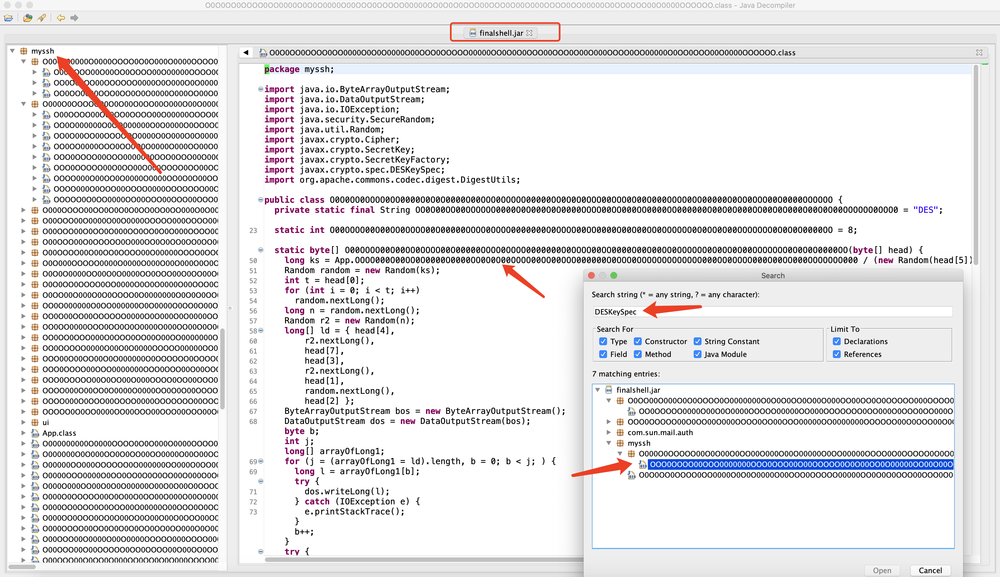
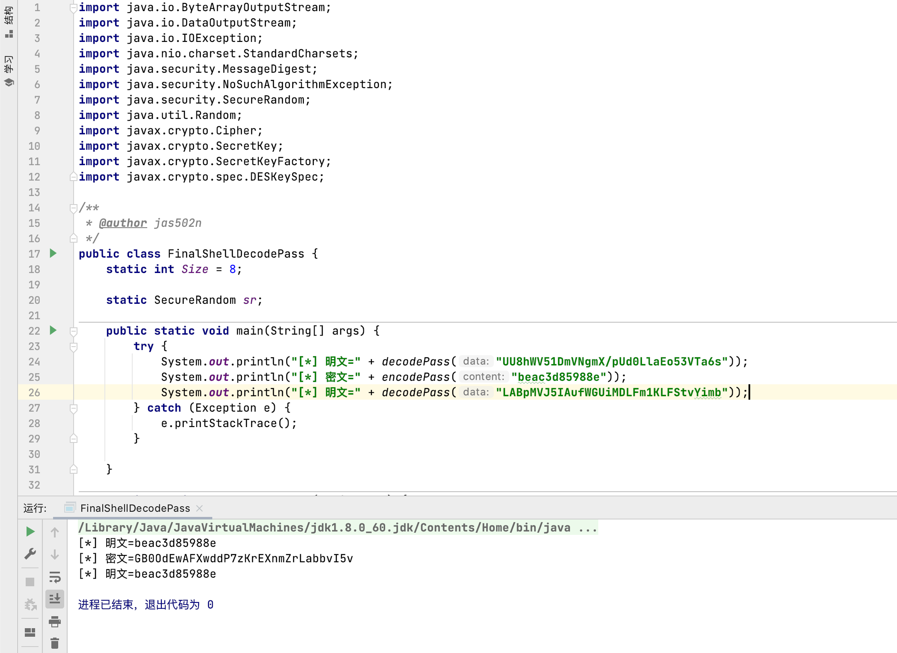

# FinalShellDecodePass 加密解密

`/Applications/FinalShell.app/Contents/Java/finalshell.jar!/myssh/O0O0OO0OOOO0OO0000O0O0O0000O00OOO0OOOOO00000OO0O0O0OOO00OOO0O00O000OOOO0OO00000O0OO0OOO00O0000OOOOOO.class`


`password` 字段在 `~/Library/FinalShell/conn/xxxxxx/xxxxxx_connect_config.json`

快速查找
```bash
$ ~/Library/FinalShell/conn

$ grep -rni "password" *
```



#### 例如: 

将明文`beac3d85988e` 加密成密文得到 `OGNqLj1Le11Br3AIelAiPaDJpfhBzmEN`

将密文`UU8hWV51DmVNgmX/pUd0LlaEo53VTa6s` 解密得到明文 `beac3d85988e`

```bash

$ javac FinalShellDecodePass.java
$ java FinalShellDecodePass
>>>>
[*] 明文=beac3d85988e
[*] 密文=OGNqLj1Le11Br3AIelAiPaDJpfhBzmEN
[*] 明文=beac3d85988e
```


